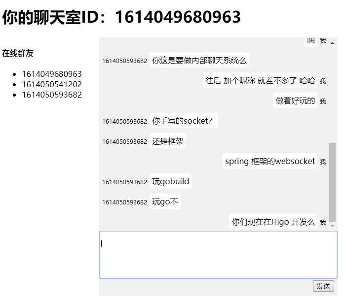

# springboot-webflux-websocket-im

#### 介绍
本项目基于webflux websocket实现

#### 软件架构
springboot、webflux、websocket、redis

#### 安装教程
1.  部署redis服务，或者修改application.properties中的redis配置。
2.  执行mvn clean package命令。
3.  运行bin文件夹的init_service.sh启动项目。

#### 使用说明
1.  本地启动项目后，浏览器访问http://localhost:8081/im 即可进入聊天室。

#### 聊天室截图

